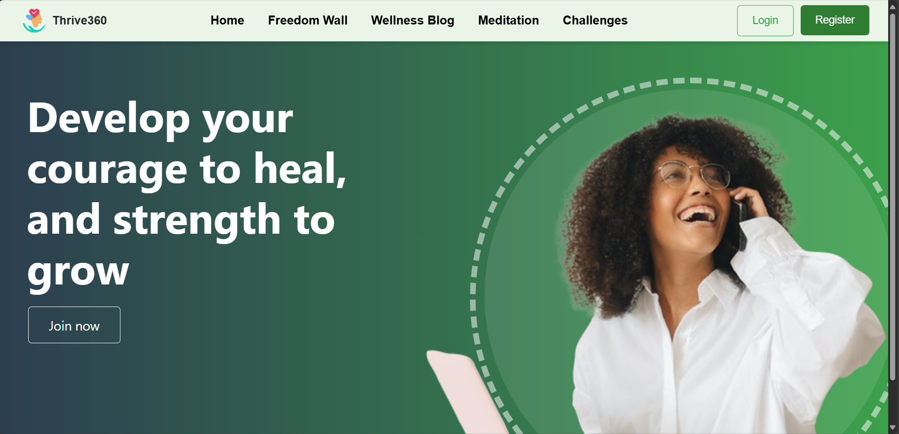
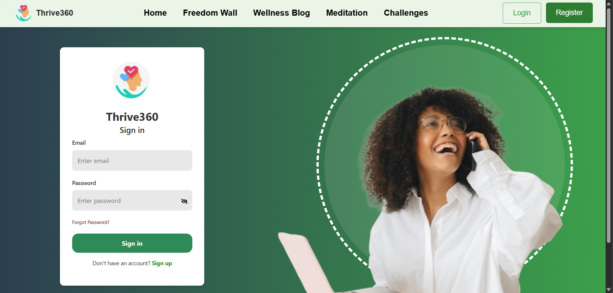
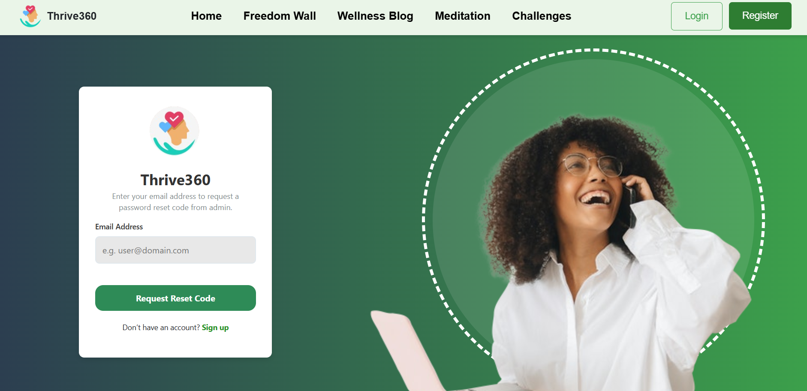
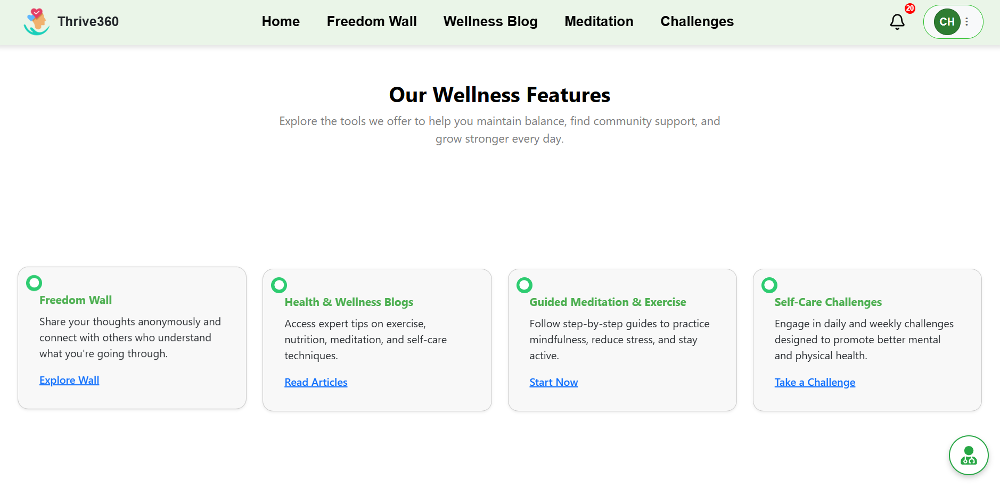
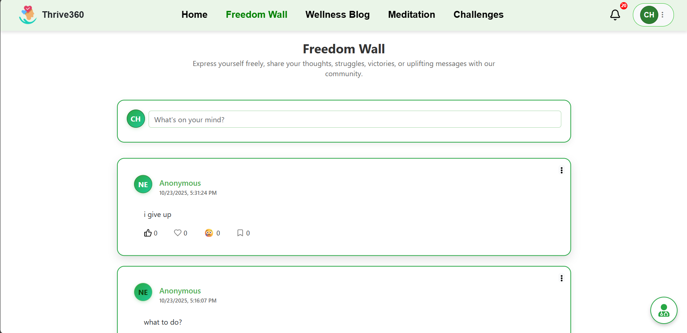
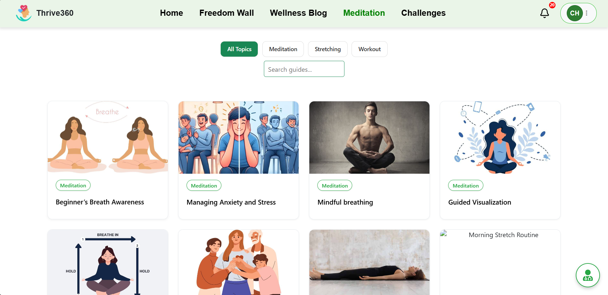
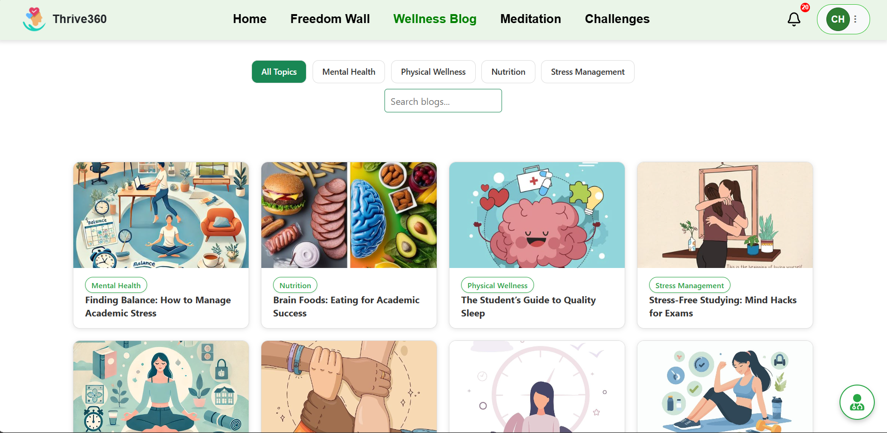
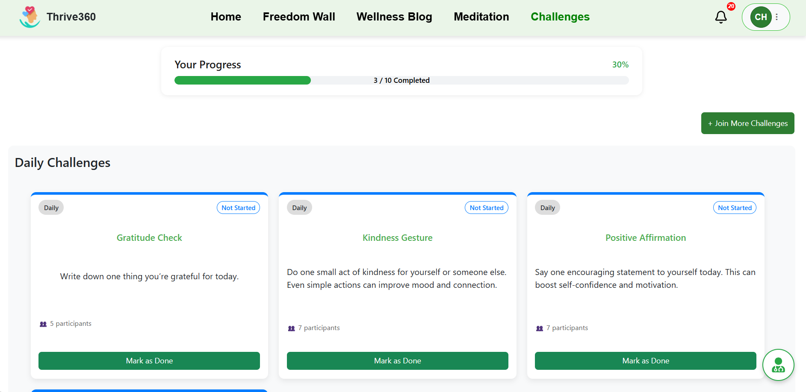
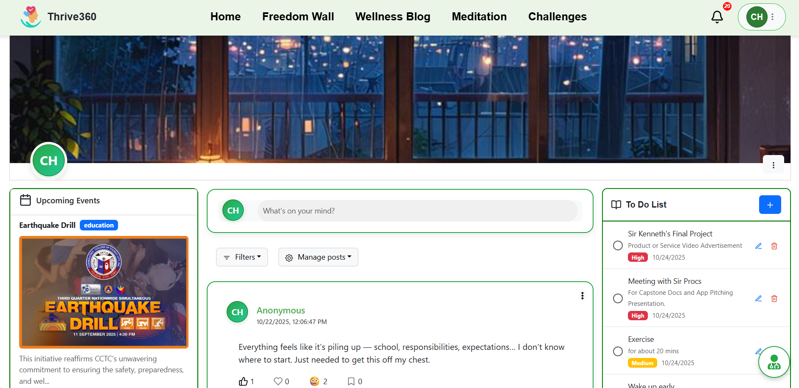

#THRIVE360
THRIVE360: A WEB-BASED PLATFORM SUPPORTING STUDENT HEALTH, WELL-BEING, AND PERSONALIZED DIGITAL TOOLS

# FEATURES:
*  Share posts on the Freedom Wall anonymously.
*  Read plain and simple tips on health and self-care.
*  Follow the instructions to guide your meditation and exercise.
*  Reduce stress with a trouble free-to-do-list.
*  Join fun self-care challenges for well-being.

# Course Overview
* Front-End Web Development
* UI/UX Design Principles
* Responsive Web Design
* System Analysis & Design
* User-Centered Development

# Tech Stack
* React
* Vite
* React Bootstrap
* HTML, CSS and JavaScript

# Landing Page 
  

# Sign In Page
  

# Sign Up Page
  

# Forgot Password Page
  

# Home Screen
  

# Freedom Wall Screen
  

# Meditation Screen
  

# Wellness Blog Screen
  

# Challenges Screen
  

# Profile Screen
  

 # Screen Demo
 < a href="https://www.youtube.com/watch?v=wPib5SC3wOk">
   
  

